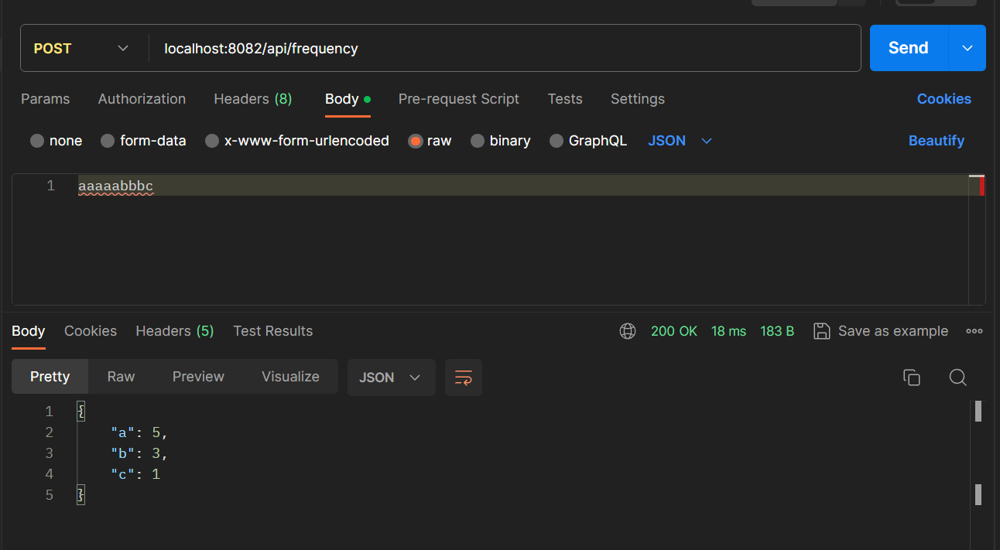

Рекомендации по запуску:
1. Убедитесь, что у вас установлен Java Development Kit (JDK) версии 17 или выше.
2. Убедитесь, что в вашем проекте прописаны все необходимые зависимости из файла pom.xml.
3. Скомпилируйте и упакуйте ваш проект с помощью Maven, используя команду mvn clean package.

Формат входящих параметров:

Метод calculateFrequency контроллера принимает строку в формате JSON в параметре inputString. Пример JSON-запроса для тестирования:
{
  "inputString": "aaaaabbbc"
}

Формат исходящих параметров:
Метод calculateFrequency возвращает результат в виде отсортированного мапа символов и их частоты в формате JSON. Пример JSON-ответа:

{
  "a": 5,
  "b": 3,
  "c": 1
  // и так далее, в зависимости от входной строки
}

Ссылка для теста через Swagger
http://localhost:8082/swagger-ui.html#/frequency-controller